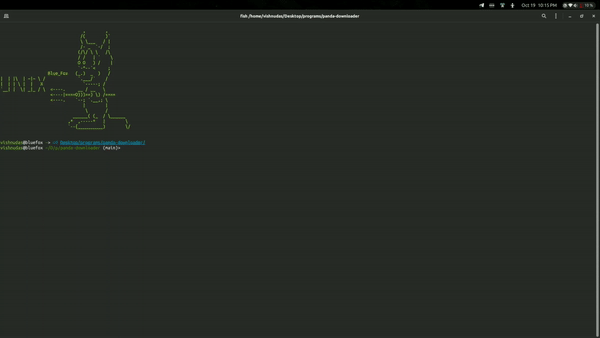
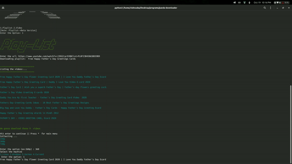
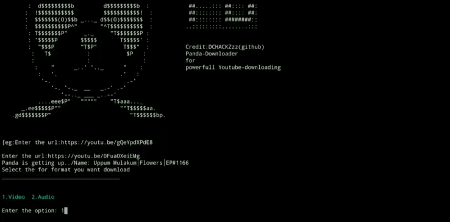

# panda-downloader


created by: Vishnudas-bluefox

                   


    

youtube:https://youtu.be/gQeYpdXPdE8

instagram: https://www.instagram.com/charvaakan/

    


feel the real power...

*completly free and secure youtube downloading
 

*no compromise in privacy


*high speed downloading


## Download playlist in one cick

 
### Download all videos


Download like pro! don't use stupid websites and applications any more!

### for linux

```python
apt-get upgrade && apt-get update
```
```python
apt-get install git
```
```python
apt-get install python3
```
```python
git clone https://github.com/DCHACKZzz/panda-downloader
```
```python
cd panda-downloader
```
```python
pip install -r requirements.txt
```
```python
./panda.py
```


Download path linux: Desktop
## for termux
## ----------

```
pkg update && pkg upgrade
```
```
pkg install git python -y
```
```
termux-setup-storage
```
Allow the storage permission for downloading path
```
git clone https://github.com/DCHACKZzz/panda-downloader
```
```
cd panda-downloader
```
```
pip install typing_extensions
```
```
pip install -r requirements.txt
```
```
./panda.py
```

Download path of termux: Download/panda-downloader/

for windows
-

before going to open cmd download git and python and install 

https://git-scm.com/download/win

https://www.python.org/downloads/windows/

open cmd  then

```
git clone https://github.com/DCHACKZzz/panda-downloader
```
```
cd panda-downloader
```
```
python3 -m pip install typing_extensions
```
```
pip install -r requirements.txt
```
```
./panda.py
```
Download path of windows: desktop/panda-downloader


wakeup the panda and enjoy the style 





Portfolio: http://vishnudasbluefox.co/?i=1

your donations are important for our future projects


donate:


if you like what i do, maybe consider buying me a coffee/tea 🥺👉👈

<a href="https://buymeacoffee.com/vishnudas" target="_blank"></a>


 
<a href="https://www.instagram.com/charvaakan/">
  
</a>

<a href="https://twitter.com/vishnudasbluef1">
  
</a>
<a href="https://www.linkedin.com/in/vishnudas-python-developer/">
  
 </a>
<br>
